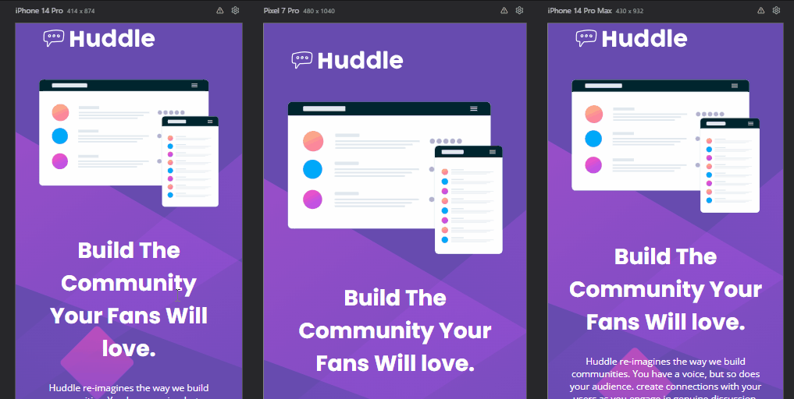

# Projeto HUDDLE BASE com README.

## Descrição 📝
Projeto do curso DEV EM DOBRO para avaliação com um arquivo README. Realizado sozinho, seguindo o aprendizado das aulas e consultando anotações de resumos pessoais.

💻- Segue a imagem prévia do projeto, versão desktop com botões e fontes devendo ter click.

[]

Este desafio está disponível no site Frontend mentor, a partir dele foi realizado este projeto para avaliação.

💻- Visualização final do projeto realizado.

[ 
]

📱- Visualização final do projeto em mobile.

[
]

## Meus desafios no processo. 🤯
Acabei tendo um pouco de dificuldade na hora de codar as Font Awesome, não conseguia alterar o cursor do mouse ao interagir com as fontes e botao, e na estilização de profunfidade do botão e também, me confundi ao colocar borda e estilizar as font awesome, mas seguindo meus resumos rapidamente resolvi.

Também tive um pouco de trabalho na responsividade e novamente fui salvo pelos resumos, as outras versões ficaram excelentes.

grato!😊

## Como Utilizar. 👨‍💻

Clone com o projeto:
```
git clone https://github.com/HenryRomao/PROJ.HUDDLE-BASE.git
```

Acesse a pasta do projeto:
```
cd PROJ.HUDDLE-BASE 
```

Bom estudo. 🍀


## Tecnologias utilizadas. 
- HTML
- CSS